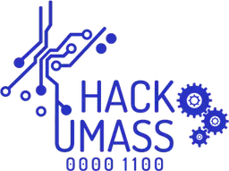
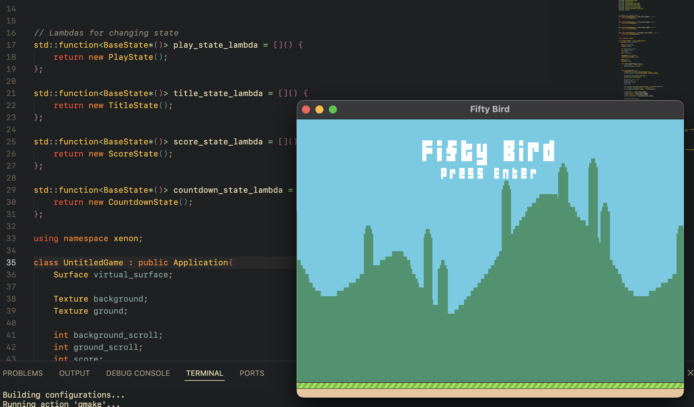
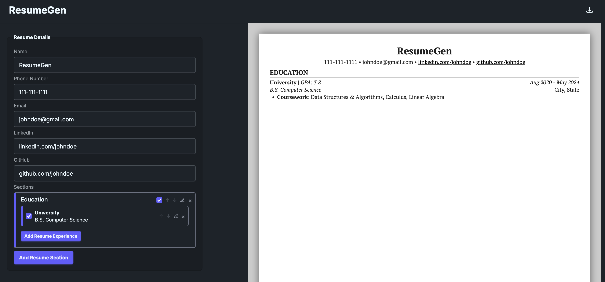
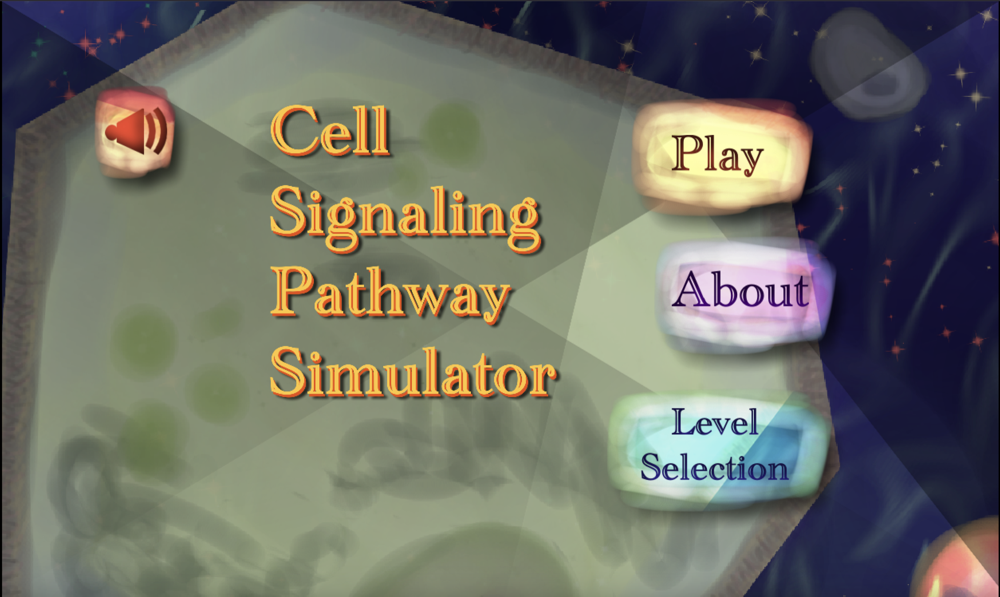
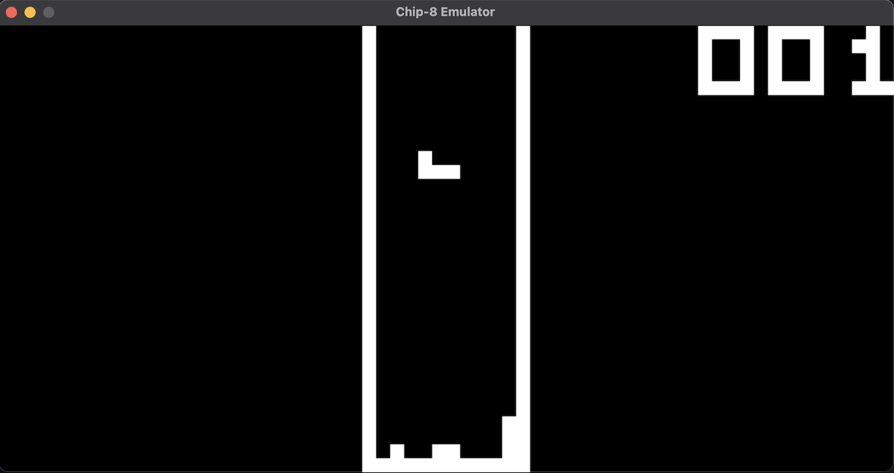
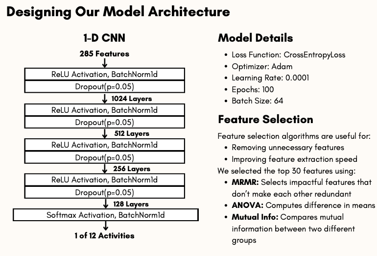
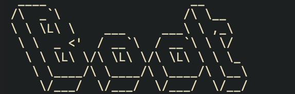

# 👋👋👋 Welcome! 
My name is Shreyas Donti, and I'm a junior Honors student at the University of Massachusetts Amherst pursuing a double major in Computer Science & Electrical Engineering. Nice to meet you!

I'm interested in everything tech - from video game development to programming languages - to hardware and machine learning. If it's tech, I want to learn more! My primary interests within CS are low-level and embedded systems software, and within EE I'm hugely passionate about working with electronics and FPGAs!

## 📊 My Stats

 

## 🗂️ My Projects
| | **** |
|---|---|
| | **Xenon2D Game Engine** |
| | **ResumeGen - An easy-to-use resume builder for the web** |
| | **Cell Signaling Simulator for HackHer413 2024**  |
| | **Chip-8 Emulator in Rust** |
| | **HAR Machine Learning Classifier** |
| | **Boot CLI Project Manager**  |

## 🧑‍💻 My Technologies
| Category              | Badges                                                                 |
|-----------------------|-----------------------------------------------------------------------|
| **Programming Languages** |             |
| **Libraries & Frameworks** |              |
| **Tools** |                      |

## 🔗 My Links
 

